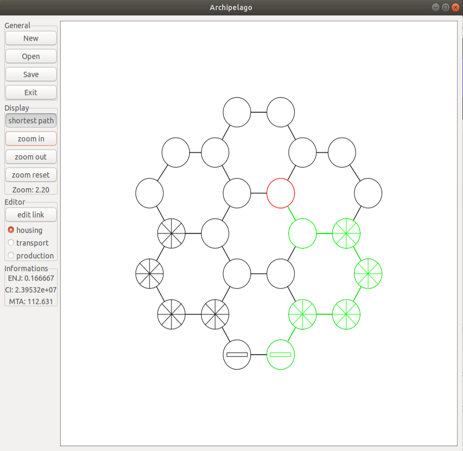
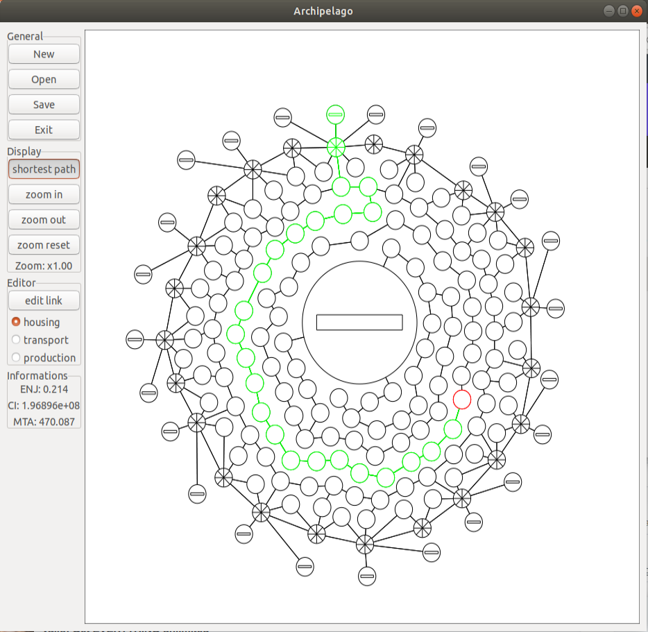

# Archipelago

This repository has been created for the project of the course "Programmation" with <a href="https://people.epfl.ch/ronan.boulic">Prof. Ronan Boulic</a> in BA2.  
Due to a predicted rise in sea level, a city-state on the edge of the ocean decides to transform itself into a floating city. We have developed a tool to evaluate a city plan in which each district is a circular island and the districts are linked by floating bridges. Certain efficiency criteria are systematically evaluated.

## Specifications

- Types of districts:
  + Housing (empty circle)
  + Transport (circle with lines)
  + Production (circle with rectangle)
- Criteria:
  + Night-Day balance (ENJ):  difference in capacity between all districts dedicated to rest (Housing) on the one hand, and all districts dedicated to daytime activity (Transport/Production) on the other.
  + Infrastructure cost (CI): cost of the infrastructure represented by all the connections.
  + Best Access Time (MTA): calculated for all housing nodes. For each the sum of the best access time to a Transport node and the best access time to a Production to a Production node.
- Shortest Path:  
  A variant of Dijkstra's algorithm has been implemented to find the optimal path (shown in green) between a housing node and a transport node, as well as a production node.

## Graphical User Interface (GUI)

  
  

